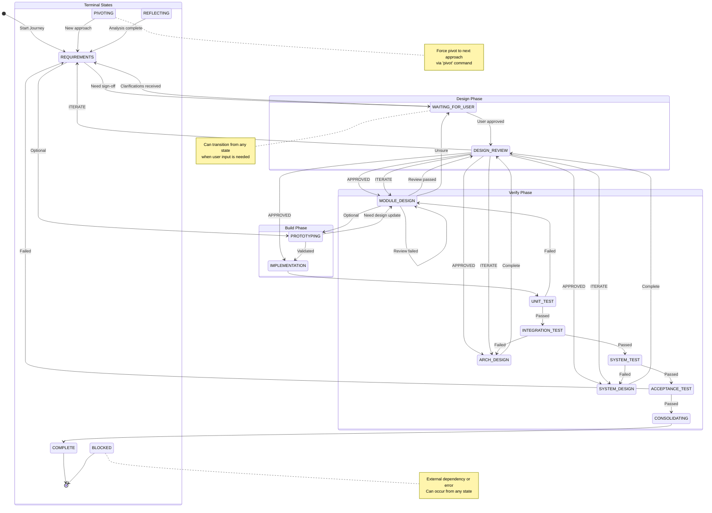

# V-Model Protocol Specification

**Formal specification of the V-Model development lifecycle protocol for autonomous R&D agents.**

**Audience**: AI agents, developers implementing V-Model systems

**For user-facing documentation**, see [USER_GUIDE.md](USER_GUIDE.md).

---

## 1. Protocol Overview

The V-Model protocol defines a formal development lifecycle for autonomous R&D agents. It combines:

- **Architecture-driven development**: Formal decomposition into Epics → Stories → Tasks
- **Rigorous verification**: Each design level has a corresponding verification stage
- **Design review**: External consultation (Gemini) for design quality and research thoroughness
- **Safe rollback**: Git checkpointing at key milestones
- **Dead-end detection**: Automatic pivot when approaches stagnate

### 1.1 State Machine

The protocol implements a state machine with 15 states:



### 1.2 State Definitions

| State | Type | Description |
|:------|:------|:-------------|
| `REQUIREMENTS` | Design | Formalizing User Requirements into System Requirements |
| `DESIGN_REVIEW` | Review | Automatic consultation for design quality |
| `SYSTEM_DESIGN` | Design | High-level architectural planning (Epics) |
| `ARCH_DESIGN` | Design | Component-level design (Sub-systems/Interfaces) |
| `MODULE_DESIGN` | Design | Low-level logic design for a single Story |
| `PROTOTYPING` | Build | Optional experimental phase |
| `IMPLEMENTATION` | Build | Coding the specific module/story |
| `UNIT_TEST` | Verify | Verifying the specific module logic |
| `INTEGRATION_TEST` | Verify | Verifying interaction with the system |
| `SYSTEM_TEST` | Verify | Verifying against original Spec |
| `ACCEPTANCE_TEST` | Verify | Final validation against User Requirements |
| `CONSOLIDATING` | Verify | Cleaning up, syncing to memory.md, final verification |
| `WAITING_FOR_USER` | Control | Awaiting clarification or sign-off |
| `COMPLETE` | Terminal | Goal achieved, journey finished |
| `BLOCKED` | Terminal | Blocked by external dependency or error |
| `PIVOTING` | Control | Force pivot to next approach |
| `REFLECTING` | Control | Forced reflection phase |

---

## 2. Spec Initiation Protocol

Before starting a journey, an AI agent MUST execute this protocol to establish a high-fidelity specification with the user.

### 2.1 Goal Extraction Phase (Q&A)

The agent MUST ask these specific questions:

1. **Metric-Driven Goals**: Current baseline metrics and target values for success
2. **Scope and Boundaries**: What files/modules are in scope, what must not be touched
3. **Constraint Identification**: Memory, threading, standards requirements
4. **Verification Strategy**: How to prove the goal is achieved (existing tests vs new harness)
5. **Anti-Pattern Mining**: Already-tried approaches that failed, known gotchas

### 2.2 Specification Construction

Create the `{journey_name}.spec.md` file with:

#### User Requirements (The "Why")
- Human-readable goals and the value they provide

#### System Requirements (The "What")
- Technical, measurable specifications

#### Acceptance Criteria (The "How we prove it")
- The exact tests or benchmarks that must pass

#### Initial Epic Breakdown
- High-level milestones (Epics) needed to reach the goal

### 2.3 Sign-Off Protocol

After creating the Spec, set journey state to `WAITING_FOR_USER` and present the Spec. Ask:

> "I have drafted the System Specification based on our discussion. Please review the goals, metrics, and acceptance criteria in `[journey_name].spec.md`. Once you provide a sign-off or a 'proceed' hint, I will begin the SYSTEM_DESIGN phase."

**Do not proceed to SYSTEM_DESIGN until the user provides confirmation.**

### 2.4 Optional Guardrails

Before design begins, define optional constraints:

#### Performance Constraints
- Performance Budgets: Max CPU%, Latency (ms), Memory (KB)
- Platform limits (ARM clock speed, iOS background tasks, threading model)

#### Quality Assurance Tooling
- Linters: `clang-tidy`, `eslint`, `shellcheck` (zero tolerance)
- Static Type Checkers: `mypy`, `flow`, C++ strict type checking
- Dynamic Checkers: ASan, UBSan, Valgrind
- Code Coverage: Target coverage % for new modules

#### Dependency Guidelines
- What libraries can/cannot be added
- Version constraints
- License compatibility requirements

---

## 3. V-Model Stages

### 3.1 REQUIREMENTS

**Purpose**: Formalize User Requirements into System Requirements

**Protocol**:
1. Execute Spec Initiation Protocol (see above)
2. Conduct research before finalizing requirements:
   - Web search for similar systems/libraries
   - Consult memory.md for past learnings
   - Use external AI (Gemini) for complex tradeoffs
3. Document research in "## Research Notes > ### REQUIREMENTS Phase Research"
4. Create or update `{journey_name}.spec.md`
5. Transition to `WAITING_FOR_USER` for sign-off
6. After sign-off, update "Previous Phase: REQUIREMENTS" in Meta section
7. Transition to `DESIGN_REVIEW`

**Output**: Updated System Requirements in the Spec

### 3.2 DESIGN_REVIEW

**Purpose**: Automatic external consultation for design quality and research thoroughness

**Protocol**:
1. Extract design content from the previous phase
2. Extract research notes for that phase
3. Consult external AI (Gemini) with both design and research
4. Parse decision:
   - If `DECISION: ITERATE`: Transition back to previous design phase
   - Otherwise: Auto-transition to next design phase

**Transition Mapping**:
- `REQUIREMENTS` → `SYSTEM_DESIGN`
- `SYSTEM_DESIGN` → `ARCH_DESIGN`
- `ARCH_DESIGN` → `MODULE_DESIGN`
- `MODULE_DESIGN` → `IMPLEMENTATION`

### 3.3 SYSTEM_DESIGN

**Purpose**: High-level architectural planning (Epics)

**Protocol**:
1. Conduct research:
   - Web search for architectural patterns
   - Search codebase for similar implementations
   - Use external AI for architectural tradeoffs
2. Document research in "## Research Notes > ### SYSTEM_DESIGN Phase Research"
3. Decompose goal into **Epics**
4. Identify cross-cutting concerns (memory, threading, API)
5. Update Design Spec with architecture and Epics list
6. Update "Previous Phase: SYSTEM_DESIGN" in Meta section
7. Transition to `DESIGN_REVIEW`

**Output**: `Epics` list in the Spec

### 3.4 ARCH_DESIGN

**Purpose**: Component-level design (Sub-systems/Interfaces)

**Protocol**:
1. Conduct research:
   - Search for existing interfaces/APIs in codebase
   - Web search for component design patterns
   - Use external AI for interface decisions
2. Document research in "## Research Notes > ### ARCH_DESIGN Phase Research"
3. Select current Epic
4. Decompose Epic into **Stories** (Sub-systems/Interfaces)
5. Update Design Spec and Journey file
6. Update "Previous Phase: ARCH_DESIGN" in Meta section
7. Transition to `DESIGN_REVIEW` for the first/next Story

**Output**: Component interfaces and sub-system design

### 3.5 MODULE_DESIGN

**Purpose**: Low-level logic design for a single Story

**Protocol**:
1. Conduct research:
   - Search codebase for similar functions/classes
   - Web search for algorithm implementations
   - Use external AI for edge cases
2. Document research in "## Research Notes > ### MODULE_DESIGN Phase Research"
3. Select current Story
4. Create detailed technical design: signatures, state changes, error handling
5. **Perform Design Review**: Critique for leaks, complexity, performance
6. If review fails, stay in `MODULE_DESIGN` and fix
7. If unsure, transition to `WAITING_FOR_USER`
8. If passed, update "Previous Phase: MODULE_DESIGN" in Meta section
9. Transition to `DESIGN_REVIEW`

**Output**: `Current Story Design` with "Review Passed" stamp

### 3.6 PROTOTYPING (Optional)

**Purpose**: Experimental phase to validate complex algorithms

**Protocol**:
1. Use Python/C++ for rapid prototyping
2. Validate approach before production implementation
3. If successful, transition back to `MODULE_DESIGN` or `IMPLEMENTATION`
4. If failed, transition back to `MODULE_DESIGN` with learnings

**Trigger**: Optional transition from `REQUIREMENTS` or `MODULE_DESIGN`

### 3.7 IMPLEMENTATION

**Purpose**: Coding the specific module/story

**Protocol**:
1. Code exactly one Story based on approved `MODULE_DESIGN`
2. Run basic guardrails (build)
3. Transition to `UNIT_TEST`

**Output**: Production code changes

### 3.8 UNIT_TEST

**Purpose**: Verifying the specific module logic

**Protocol**:
1. Run tests specific to the module/story
2. Analyze logs and edge cases
3. If fails, transition back to `MODULE_DESIGN`
4. If passes, transition to `INTEGRATION_TEST`

### 3.9 INTEGRATION_TEST

**Purpose**: Verifying interaction with the system

**Protocol**:
1. Run system-wide tests (`ALL_TESTS_COMMAND`)
2. Verify new module interacts correctly with existing components
3. **Automated Audit Gate**: Run linters and static analyzers
   - All linting errors must be resolved (zero tolerance)
   - Static analysis warnings should be addressed or documented
4. If fails, transition back to `ARCH_DESIGN`
5. If passes:
   - Check if this was the last story in current epic
   - If yes, mark Epic complete and check for more epics
   - If more epics, transition to `WAITING_FOR_USER` (auto-transitions to next epic)
   - If no more epics, transition to `SYSTEM_TEST`
   - If not last story, transition back to `MODULE_DESIGN` for next story

### 3.10 SYSTEM_TEST

**Purpose**: Verifying against original Spec

**Protocol**:
1. Verify entire system against **System Requirements** in Spec
2. Run full test suite, not just affected tests
3. Check performance metrics (CPU, latency) against thresholds
4. If fails, transition back to `SYSTEM_DESIGN`
5. If passes, transition to `ACCEPTANCE_TEST`

### 3.11 ACCEPTANCE_TEST

**Purpose**: Final validation against User Requirements

**Protocol**:
1. Verify against **User Requirements** and final **Acceptance Criteria**
2. Check guardrails if defined
3. If everything passes, transition to `CONSOLIDATING`
4. If fails, transition back to `REQUIREMENTS`

### 3.12 CONSOLIDATING

**Purpose**: Cleanup, document, and finalize

**Protocol**:
1. Cleanup and finalize Design Spec
2. Sync learnings to `memory.md`
3. Transition to `COMPLETE`

---

## 4. Data Structures

### 4.1 Journey File Format

Journey files are stored as `{PROJ_ROOT}/v_model/journey/{name}.journey.md`

**Required Sections**:

```markdown
# Journey: {goal}

## Meta
- Goal: {goal}
- State: {current_state}
- Previous Phase: {last_completed_design_phase}
- Current Epic: {epic_id}
- Started: {UTC_timestamp}
- Current Approach: {approach_number}
- Progress: {percentage}

## Approaches
### Approach {N}: {name}
- Status: PENDING/ACTIVE/ABANDONED/COMPLETE
- Reason: {description}
- Iterations: {count}

## Current Approach Detail
### Approach {N}: {name}
- Hypothesis: {description}
- Milestones: [checklist]

## Guardrails
- [status] {constraint}

## Baseline Metrics
| Metric | Baseline | Current | Threshold |
|--------|----------|---------|-----------|

## User Hints
- {timestamp}: "{hint}"

## Research Notes
### REQUIREMENTS Phase Research
{content}

### SYSTEM_DESIGN Phase Research
{content}

### ARCH_DESIGN Phase Research
{content}

### MODULE_DESIGN Phase Research
{content}

## Epic Progress
| Epic ID | Name | Status | Stories Complete | Total Stories |

## Generated Artifacts
{list}

## Learnings Log
- {timestamp}: {learning}

## Dead Ends
### {approach_name}
- Status: ABANDONED
- Reason: {description}
- Learnings: {learnings}
- Abandoned: {date}

## Anti-Patterns
- **{pattern}**: {description}

## Pending Questions
- [ ] {date}: {question}

## Design Spec
{link_to_spec}

## Checkpoints
| ID | Tag | Date | Description |
```

### 4.2 Spec File Format

Spec files are stored as `{PROJ_ROOT}/v_model/journey/{name}.spec.md`

**Required Sections**:

```markdown
# Design Spec: {goal}

> **Journey**: {journey_name}
> **Created**: {UTC_timestamp}
> **Status**: DRAFT/COMPLETE

## Overview
**Goal**: {goal}

## Approach
{approach_details}

## User Requirements
{requirements}

## System Requirements
{requirements}

## Acceptance Criteria
{criteria}

## Baseline Metrics
{metrics}

## Epics
### E1: {epic_name}
- Stories: {list}
- Status: PENDING/IN_PROGRESS/COMPLETE

## Architecture
{architecture_description}

## Implementation Plan
### Phase 1: Research and Planning
### Phase 2: Prototyping
### Phase 3: Implementation
### Phase 4: Consolidation

## Success Criteria
- [ ] {criterion}

## Changes Made
{changes}

## Documentation Updates
{updates}

## References
{links}
```

---

## 5. Algorithms

### 5.1 Dead-End Detection

**Purpose**: Detect when an approach is stuck and trigger a pivot

**Algorithm**:

```
IF (current_iterations_in_state >= MAX_STALE_ITERATIONS) AND
   (progress_percent < MIN_PROGRESS_PERCENT) THEN
    Trigger pivot to next approach
END IF
```

**Variables**:
- `MAX_STALE_ITERATIONS`: Default 3
- `MIN_PROGRESS_PERCENT`: Default 5

**Actions on Dead End**:
1. Log dead end in journey file with reason and learnings
2. Extract learnings to `memory.md`
3. Increment approach number
4. Reset state to `REQUIREMENTS` for new approach

### 5.2 Epic Completion Detection

**Purpose**: Detect when all stories in an epic are complete

**Algorithm**:

```
IF (journey.learnings_log contains "Epic {Epic_ID} COMPLETED") THEN
    Mark epic complete in progress table
    Check for next epic
    IF next_epic EXISTS THEN
        Transition to WAITING_FOR_USER (auto-transition to next epic)
    ELSE
        Transition to SYSTEM_TEST
    END IF
END IF
```

### 5.3 Design Review Transition

**Purpose**: Auto-transition from `DESIGN_REVIEW` to next phase

**Algorithm**:

```
PREVIOUS_PHASE = journey.meta.previous_phase

IF gemini_feedback contains "DECISION: ITERATE" THEN
    NEW_STATE = PREVIOUS_PHASE
ELSE
    SWITCH PREVIOUS_PHASE
        CASE REQUIREMENTS:   NEW_STATE = SYSTEM_DESIGN
        CASE SYSTEM_DESIGN:  NEW_STATE = ARCH_DESIGN
        CASE ARCH_DESIGN:    NEW_STATE = MODULE_DESIGN
        CASE MODULE_DESIGN:  NEW_STATE = IMPLEMENTATION
        DEFAULT:             NEW_STATE = SYSTEM_DESIGN
    END SWITCH
END IF

journey.state = NEW_STATE
```

### 5.4 Previous Phase Detection

**Purpose**: Determine which design phase just completed

**Algorithm**:

```
IF journey.meta.previous_phase EXISTS AND != "TBD" THEN
    RETURN journey.meta.previous_phase
ELSE
    # Fallback: infer from learnings log
    IF learnings_log contains "Transitioned to.*SYSTEM_DESIGN" THEN
        RETURN "REQUIREMENTS"
    ELSE IF learnings_log contains "Transitioned to.*ARCH_DESIGN" THEN
        RETURN "SYSTEM_DESIGN"
    ELSE IF learnings_log contains "Transitioned to.*MODULE_DESIGN" THEN
        RETURN "ARCH_DESIGN"
    ELSE IF learnings_log contains "Transitioned to.*IMPLEMENTATION" THEN
        RETURN "MODULE_DESIGN"
    ELSE
        RETURN "UNKNOWN"
    END IF
END IF
```

---

## 6. Verification Best Practices

### 6.1 Test-Driven Design (TDD)

- Draft `UNIT_TEST` and `INTEGRATION_TEST` signatures **before** `IMPLEMENTATION`
- Define expected inputs/outputs and edge cases upfront
- This clarifies the contract before coding begins

### 6.2 Negative Testing

- Include tests for failure modes (empty buffers, timeouts, null pointers)
- Test boundary conditions (max values, zero, negative)
- Verify graceful degradation under stress

### 6.3 Performance Benchmarking

- Run benchmarks and compare against baseline metrics
- If guardrails were defined, validate against them
- Document any performance regressions with root cause analysis

### 6.4 Regression Verification

- Ensure existing tests still pass after changes
- Run full test suite, not just new tests

---

## 7. Research Protocol

Each design phase includes an implicit research step. Before finalizing any design:

** Read `generic-best-practices.md` before starting research.**
- This document contains 20 generic best practices applicable to ALL software projects
- Every line of code is a liability - reuse proven solutions
- Reference: `./ai-v-model/generic-best-practices.md`

### 7.1 Standard Research Protocol (Parallel Exploration)

**Launch 3 Explore agents IN PARALLEL** (single message, multiple Agent tool calls):

**Agent 1: Codebase Search**
- Search for existing implementations of similar functionality
- Check for reusable patterns, interfaces, or modules
- Look for anti-patterns and successful patterns in memory.md
- Report: "Found X existing implementations: [files], patterns used: [list]"

**Agent 2: External Solutions Search**
- Web search for existing libraries/frameworks that solve this problem
- Check platform/vendor official libraries (Google, Apple, Microsoft, etc.)
- Look for libraries with strong community adoption (>10k stars, active maintenance)
- Report: "Found N candidate libraries: [names, URLs, why relevant]"

**Agent 3: Best Practices Check**
- Read `generic-best-practices.md` for relevant principles
- Search for domain-specific best practices and anti-patterns
- Check for established design patterns for this problem type
- Report: "Applicable best practices: [principles], recommended patterns: [list]"

**After agents report back:**
1. Consolidate findings into journey file under "## Research Notes"
2. **CRITICAL DECISION**: Build vs Reuse
   - If a well-maintained library exists: USE IT
   - If codebase has a reusable pattern: ADAPT IT
   - Only build custom if no viable solution exists
3. Document your decision with justification
4. Cite all sources (URLs, file paths, memory entries)

### 7.2 Additional Research Tools

**Web Search** (used by Agent 2, above):
- Search for existing libraries, frameworks, solutions
- Look for best practices and anti-patterns
- Use current year in queries (2026)

**External AI Consultation** (optional, for complex tradeoffs):
- Use external AI to talk through design reasoning
- Ask about edge cases, failure modes, alternatives
- Example: `echo "What are tradeoffs between X and Y?" | gemini --yolo`

### 7.3 Codebase Research

- Search for existing implementations
- Check `memory.md` for project-specific learnings
- Review test data and examples

### 7.4 Literature Review

- Whitepapers, RFCs, technical standards (DSP, embedded, audio)
- Academic papers for algorithmic approaches
- Platform-specific documentation (Apple HIG, Android NDK guides)

### 7.5 Prior Art Search

- `grep -r "similar_pattern" --include="*.cpp"`
- Check commit history for related changes
- Review closed issues/PRs for context

### 7.6 Constraint Discovery

- Physical limits (sample rates, buffer sizes)
- Platform constraints (real-time requirements, memory tiers)
- Backward compatibility requirements

### 7.7 Document Findings

- Add findings to journey file under "## Research Notes"
- Include sources (URLs, file paths)
- Note rejected alternatives with reasons

---

## 8. Implementation Guidelines

### 8.1 Anchor the Endpoint

The `Acceptance Criteria` must include specific CLI commands to verify success.

**Example**:
```markdown
## Acceptance Criteria
- `ctest -R filter_tests` passes with 100% success
- `npm run test -- --coverage` shows >80% line coverage
- Latency benchmark: `./bench_latency` reports <10ms p99
```

### 8.2 No Vibe Coding

If a design proposes a solution without citing a "Research Note" or "Existing Pattern," the `DESIGN_REVIEW` must reject it. Every implementation decision should be grounded in:
- Prior art in the codebase
- External research (papers, documentation, best practices)
- Explicit trade-off analysis
- **Generic Best Practices**: Consult `generic-best-practices.md` before designing
  - Prefer existing solutions (libraries, frameworks, standard APIs)
  - Don't reinvent well-known algorithms, patterns, or infrastructure
  - Example: Use Workbox for service workers, not custom SW code

### 8.3 Read Before Write

Before every `SYSTEM_DESIGN` or `ARCH_DESIGN` turn:
1. **Search for existing solutions FIRST**:
   - Standard libraries and platform APIs
   - Well-maintained third-party libraries
   - Vendor-provided frameworks (Google, Apple, Microsoft)
   - Refer to `generic-best-practices.md` for guidance
2. Search the codebase for related modules (`grep`, `glob`)
3. List relevant directories to understand structure
4. Review existing patterns before proposing new ones

This prevents redundant implementations and ensures consistency.

**Note**: If you're writing >200 lines of infrastructure code, you probably missed an existing solution.

### 8.4 Update Guardrails from Bugs

When a bug is found during `UNIT_TEST` or `INTEGRATION_TEST`, ask:

> "How can I update my linter, static analysis, or test suite to prevent this class of bug forever?"

**Example**: If a buffer overflow is found, add `-fsanitize=address` to the test build or add a static analysis rule for array bounds checking.

---

## 9. Design Review Checklist

During `DESIGN_REVIEW`, consider reviewing from multiple perspectives:

### Security Review
- [ ] Buffer overflows / array bounds
- [ ] Integer overflow/underflow
- [ ] Credential/secret handling
- [ ] Input validation at system boundaries
- [ ] Thread safety and race conditions

### UX/Accessibility Review (for App/PWA)
- [ ] Platform guidelines (Apple HIG, Material Design)
- [ ] Accessibility (screen readers, color contrast, touch targets)
- [ ] Responsive layout considerations
- [ ] Error messages user-friendly

### Systems Architecture Review
- [ ] No circular dependencies
- [ ] Clear module boundaries
- [ ] Appropriate abstraction levels
- [ ] Memory ownership is clear
- [ ] Error propagation is handled

### Code Quality Review
- [ ] Code follows project style guide
- [ ] No magic numbers - constants are named and documented
- [ ] Functions are single-purpose and testable
- [ ] No dead code or commented-out code blocks
- [ ] Logging/tracing at appropriate levels

### Performance Review
- [ ] No unnecessary allocations in hot paths
- [ ] Algorithm complexity is appropriate (O(n) vs O(n²))
- [ ] Caching strategy is sound (if applicable)
- [ ] No blocking operations in real-time contexts

### Maintainability Review
- [ ] Code is self-documenting or has adequate comments
- [ ] Error messages are actionable and informative
- [ ] TODOs/FIXMEs are tracked or resolved
- [ ] No premature optimization

---

## 10. Workflow Diagram

```text
  REQUIREMENTS ───────────────→ ACCEPTANCE_TEST
       ↓                              ↑
  [DESIGN_REVIEW]                    |
       ↓                              |
  SYSTEM_DESIGN ──────────────→ SYSTEM_TEST
       ↓                              ↑
  [DESIGN_REVIEW]                    |
       ↓                              |
  ARCH_DESIGN ────────────→ INTEGRATION_TEST
       ↓                              ↑
  [DESIGN_REVIEW]                    |
       ↓                              |
  MODULE_DESIGN ──────────→ UNIT_TEST
       ↓                              ↑
  PROTOTYPING (Optional) ─────────────┘
       ↓
  IMPLEMENTATION (Coding)
```

---

## 11. Parallel Execution Patterns

The V-Model supports both sequential and parallel execution modes.

### 11.1 Sequential Mode (Default)

- Single agent works through phases linearly
- Suitable for simple tasks and stories
- Lower coordination overhead

### 11.2 Parallel Mode (Complex Tasks)

**Research Phase:**
- Multiple Explore agents investigate different areas concurrently
- Each agent focuses on one research area:
  - Existing implementations in codebase
  - External research (web search, best practices)
  - Memory patterns and anti-patterns
- Orchestrator consolidates findings into Research Notes

**Implementation Phase:**
- Independent sub-tasks are executed by multiple agents
- Orchestrator manages dependencies between tasks
- Results are integrated and tested together

**Coordination:**
- Orchestrator agent consolidates results
- Manages dependencies between parallel tasks
- Ensures consistency and integration

### 11.3 When to Use Parallel Mode

Use parallel execution when:
- Research has 3+ distinct areas to investigate
- Implementation has 3+ independent modules
- Performance-critical paths where time matters

Use sequential mode when:
- Tasks are simple and well-defined
- Dependencies exist between most tasks
- Coordination overhead would exceed benefits

### 11.4 Structuring Parallel Tasks

**For Parallel Research:**
```
1. Identify distinct research areas
2. Launch Explore agents IN PARALLEL (single message, multiple tool calls)
3. Each agent reports back with findings
4. Orchestrator consolidates into Research Notes
```

**For Parallel Implementation:**
```
## Implementation Plan
- [ ] Sub-task A (can run in parallel)
- [ ] Sub-task B (can run in parallel)
- [ ] Sub-task C (depends on A and B)
- [ ] Sub-task D (depends on A and B)
```

---

## 12. State Management

Every state transition must be documented in the **Learnings Log**.

Format: `**[{timestamp}] State Transition: {from_state} → {to_state}**`

---

## 13. Epic Archival

### 13.1 Purpose

Reduce context bloat in the main journey.md file by archiving completed epic details to separate files.

As V-Model journeys progress through multiple epics, the journey.md file accumulates large amounts of detailed content:
- Research notes for each design phase (REQUIREMENTS, SYSTEM_DESIGN, ARCH_DESIGN, MODULE_DESIGN)
- Epic Decomposition sections with detailed story designs
- Learnings Log with timestamped entries
- Dead Ends and Anti-Patterns

This creates two problems:
1. **Context bloat**: The main journey file becomes very large (1,200+ lines), injecting unnecessary context into each AI iteration
2. **Difficult navigation**: Hard to find current/relevant information amidst completed epic details

### 13.2 Automatic Archival

Archival happens automatically during state transitions - no manual intervention required.

After each state transition, the loop checks for completed epics without archival files and runs the archival agent.

**Detection Logic**:
1. Check Epic Progress table for epics marked "COMPLETE"
2. Verify archival file doesn't already exist
3. Skip the current epic (still in progress)
4. Archive all other completed epics

### 13.3 Epic File Format

**File**: `{PROJ_ROOT}/v_model/journey/{name}.journey.E{id}.md`

**Contents**:
- Epic summary
- Epic decomposition (full story designs)
- Research notes for that epic's phases (SYSTEM_DESIGN, ARCH_DESIGN, MODULE_DESIGN)
- Learnings related to that epic
- Any dead ends specific to that epic

**Example Structure**:
```markdown
# Epic E1: Synthetic Test Harness - Archive

> **Journey**: create-a-test-tone-generation-pwa
> **Archived**: 2026-03-16
> **Reason**: Epic completed - reducing main journey file size

## Epic Summary
Implemented synthetic test harness for offline audio context testing...

## Epic Decomposition
{Full epic decomposition with all story designs}

## Research Notes
### SYSTEM_DESIGN Phase Research (Epic E1)
{Relevant research}
...
```

### 13.4 What Stays in Main Journey

The following sections remain in the main journey.md file (runtime-critical):

- **Meta** - State tracking (Goal, State, Previous Phase, Current Epic, Progress)
- **User Hints** - User feedback (must stay accessible)
- **Pending Questions** - Questions for user
- **Epic Progress** - Epic completion status table
- **Checkpoints** - Git checkpoint tracking
- **Design Spec** - Link to .spec.md file
- **Guardrails & Baseline Metrics** - Active constraints
- **Current Epic Summary** - Brief summary of the epic in progress
- **REQUIREMENTS Phase Research** - Needed throughout the journey
- **Approaches / Current Approach Detail** - Journey-level context
- **Anti-Patterns** - Journey-wide patterns

### 13.5 Backwards Compatibility

When this feature is added to an existing journey, archival automatically detects and archives completed epics on the next state transition.

**Example**: An existing journey with E1 and E2 complete will automatically archive both epics on the next iteration, significantly reducing the main journey file size.

### 13.6 Agent Access to Archived Content

Archived epics are not lost - the AI agent can still read them when needed:

1. **Explicit reading**: Agent can use Read tool to open epic files when referencing past work
2. **Not auto-injected**: Epic files are not included in the main journey content, reducing context
3. **Searchable**: Agent can use Grep to search across all journey files including archives

---

## 14. Extension Points

### 14.1 Custom AI Providers

The TypeScript implementation supports extensibility through the `AIProvider` interface in `src/ai-provider.ts`:

```typescript
export interface AIProvider {
  name: string;
  consult(prompt: string, options: ConsultOptions): Promise<AIResponse>;
}
```

To add a new provider:
1. Implement the `AIProvider` interface
2. Add provider initialization in `src/config.ts`
3. Register the provider in the configuration

### 14.2 Custom Verification Stages

Add custom verification stages by:
1. Extending the `VModelState` type in `src/types.ts`
2. Adding state handlers in `src/state-machine.ts`
3. Implementing phase-specific logic in `src/main-loop.ts`

### 14.3 Custom Prompt Templates

Add new prompt templates in `prompts/` directory. Templates are loaded using the `loadPrompt()` function in `src/design-spec.ts`.

### 14.4 TypeScript Module Structure

Key extension modules:
- `src/ai-provider.ts`: AI provider abstraction layer
- `src/state-machine.ts`: State transition logic
- `src/main-loop.ts`: Phase-specific handlers
- `src/journey.ts`: Journey file operations
- `src/checkpoint.ts`: Git checkpoint operations
- `src/config.ts`: Configuration management

### 14.5 CLI Commands

The TypeScript CLI is implemented in `src/index.ts` using commander.js. Commands are registered as subcommands:

```typescript
program
  .command('status')
  .description('Show status of all journeys')
  .action(statusCommand);
```

Add new commands by:
1. Creating command handler functions
2. Registering in `src/index.ts`
3. Adding help text and examples

---

**For user-facing documentation**, see [USER_GUIDE.md](USER_GUIDE.md).

**For quick reference**, see [CLAUDE.md](CLAUDE.md).
