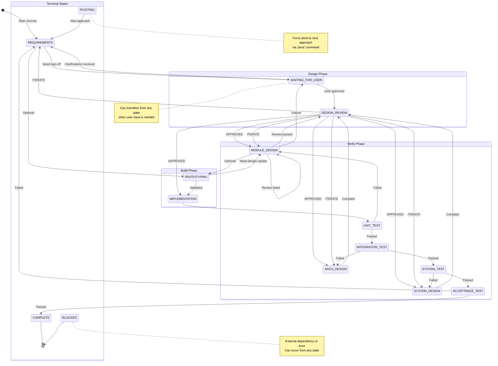

# V-Model Protocol - Architecture-Driven Autonomous Development

This document defines the **V-Model Loop** (`loop_v_model.sh`) workflow. It is designed for complex R&D tasks that require formal decomposition and rigorous verification.

---

## 1. Spec Initiation Protocol (Pre-Loop)

Before starting a journey, an AI agent MUST execute this protocol to establish a high-fidelity specification with the user. **The loop should not proceed to implementation until the "System Requirements" are signed off.**

### 1.1 Goal Extraction Phase (Q&A)

Do not assume you understand the user's intent. Start by asking these specific questions to anchor the journey:

1.  **Metric-Driven Goals**: "You want to [Goal]. What are the current baseline metrics (latency, CPU, throughput)? What are the target values for success?"
2.  **Scope and Boundaries**: "What existing files or modules are considered 'in scope'? What must NOT be touched or changed?"
3.  **Constraint Identification**: "Are there any strict memory or threading constraints? Are there specific standards (MISRA, C++17) we must adhere to?"
4.  **Verification Strategy**: "How should we prove the goal is achieved? Should I use existing tests, or do we need to build a new synthetic test harness?"
5.  **Anti-Pattern Mining**: "Have you already tried any approaches that failed? Are there specific 'gotchas' in this part of the codebase I should know about?"

### 1.2 Specification Construction

Once you have the answers, create the `{journey_name}.spec.md` file. This file is the "Source of Truth" for the entire journey. It must contain:

#### User Requirements (The "Why")
*   Human-readable goals and the value they provide.
*   Example: "Users need to detect notes in real-time with less than 20ms latency."

#### System Requirements (The "What")
*   Technical, measurable specifications.
*   Example: "The FFT processing pipeline must complete within 15ms per frame on ARMv7."

#### Acceptance Criteria (The "How we prove it")
*   The exact tests or benchmarks that must pass.
*   Example: "`test_pitch_detector` must show >98% accuracy on the `test_data/vocals.raw` dataset."

#### Initial Epic Breakdown
*   High-level milestones (Epics) needed to reach the goal.

### 1.3 Sign-Off Protocol

After creating the Spec, set the journey state to `WAITING_FOR_USER` and present the Spec to the user. Ask:

> "I have drafted the System Specification based on our discussion. Please review the goals, metrics, and acceptance criteria in `[journey_name].spec.md`. Once you provide a sign-off or a 'proceed' hint, I will begin the SYSTEM_DESIGN phase."

**Do not proceed to SYSTEM_DESIGN until the user provides confirmation.**

### 1.4 Optional: Project Guardrails

Before design begins, consider defining guardrails in the journey file. These are optional constraints that help maintain quality and prevent scope creep:

#### Performance Constraints
- **Performance Budgets**: Max CPU%, Latency (ms), Memory (KB)
- **Constraints**: Platform limits (ARM clock speed, iOS background tasks, threading model)

#### Quality Assurance Tooling
- **Linters**: `clang-tidy`, `eslint`, `shellcheck` (must pass with zero errors)
- **Static Type Checkers**: `mypy`, `flow`, C++ strict type checking
- **Dynamic Checkers**: AddressSanitizer (ASan), UndefinedBehaviorSanitizer (UBSan), Valgrind
- **Code Coverage**: Target coverage % for new modules (e.g., >80% line coverage)
- **Unit Tests**: All existing tests must pass; new code requires new tests
- **Integration Tests**: End-to-end validation of component interactions

#### Dependency Guidelines
- What libraries can/cannot be added
- Version constraints for dependencies
- License compatibility requirements

Example guardrails section in a journey file:

```markdown
## Guardrails
- CPU Budget: < 5% on ARM Cortex-A53
- Latency: < 20ms end-to-end processing
- Memory: < 100KB heap allocation
- Linters: clang-tidy (zero errors), shellcheck (zero errors)
- Static Analysis: clang-tidy, cppcheck
- Dynamic Analysis: ASan, UBSan must pass
- Code Coverage: >80% line coverage for new modules
- No new external dependencies
```

These guardrails are referenced during ACCEPTANCE_TEST to validate the final implementation.

---

## 2. V-Model Stages

The loop cycles through these formal stages, moving down the "V" for design and back up for verification.

| Stage | Type | Description |
| :--- | :--- | :--- |
| `REQUIREMENTS` | Design | Formalizing User Requirements into System Requirements. |
| `DESIGN_REVIEW` | Review | Gemini consultation for design quality and research thoroughness. |
| `SYSTEM_DESIGN` | Design | High-level architectural planning (Epics). |
| `ARCH_DESIGN` | Design | Component-level design (Sub-systems/Interfaces). |
| `MODULE_DESIGN` | Design | Low-level logic design for a single Story. |
| `IMPLEMENTATION` | Build | Coding the specific module/story. |
| `UNIT_TEST` | Verify | Verifying the specific module logic. |
| `INTEGRATION_TEST` | Verify | Verifying how the module interacts with the system. |
| `SYSTEM_TEST` | Verify | Verifying the entire system against the original Spec. |
| `ACCEPTANCE_TEST` | Verify | Final validation against User Requirements and Guardrails. |

---

## 3. Workflow Diagram

```text
  REQUIREMENTS ───────────────→ ACCEPTANCE_TEST
       ↓                              ↑
  [DESIGN_REVIEW]                    |
       ↓                              |
  SYSTEM_DESIGN ──────────────→ SYSTEM_TEST
       ↓                              ↑
  [DESIGN_REVIEW]                    |
       ↓                              |
  ARCH_DESIGN ────────────→ INTEGRATION_TEST
       ↓                              ↑
  [DESIGN_REVIEW]                    |
       ↓                              |
  MODULE_DESIGN ──────────→ UNIT_TEST
       ↓                              ↑
  [DESIGN_REVIEW]                    |
       ↓                              |
  PROTOTYPING (Optional) ─────────────┘
       ↓
  IMPLEMENTATION (Coding)
```

**Note**: `[DESIGN_REVIEW]` is an automatic Gemini consultation phase that evaluates both design quality and research thoroughness. Use `--no-consult` flag to disable.

### DESIGN_REVIEW: Persona-Based Checklist

During DESIGN_REVIEW, consider reviewing the design from multiple perspectives. This is optional but helps catch issues early:

#### Security Review
- [ ] Buffer overflows / array bounds
- [ ] Integer overflow/underflow
- [ ] Credential/secret handling
- [ ] Input validation at system boundaries
- [ ] Thread safety and race conditions

#### UX/Accessibility Review (for App/PWA)
- [ ] Platform guidelines (Apple HIG, Material Design)
- [ ] Accessibility (screen readers, color contrast, touch targets)
- [ ] Responsive layout considerations
- [ ] Error messages user-friendly

#### Systems Architecture Review
- [ ] No circular dependencies
- [ ] Clear module boundaries
- [ ] Appropriate abstraction levels
- [ ] Memory ownership is clear
- [ ] Error propagation is handled

#### Code Quality Review
- [ ] Code follows project style guide (clang-format, linting rules)
- [ ] No magic numbers - constants are named and documented
- [ ] Functions are single-purpose and testable
- [ ] No dead code or commented-out code blocks
- [ ] Logging/tracing at appropriate levels

#### Performance Review
- [ ] No unnecessary allocations in hot paths
- [ ] Algorithm complexity is appropriate (O(n) vs O(n²))
- [ ] Caching strategy is sound (if applicable)
- [ ] No blocking operations in real-time contexts

#### Maintainability Review
- [ ] Code is self-documenting or has adequate comments
- [ ] Error messages are actionable and informative
- [ ] TODOs/FIXMEs are tracked or resolved
- [ ] No premature optimization

---

## 4. Operational Instructions for the Agent

### Phase: REQUIREMENTS
*   Analyze the current project state and user hints.
*   If the Spec is incomplete, transition to `WAITING_FOR_USER` with specific questions.
*   Output: Updated `System Requirements` in the Spec.

### Phase: SYSTEM_DESIGN
*   Break the journey into **Epics**.
*   Identify cross-cutting concerns (memory, threading, API).
*   Output: `Epics` list in the Spec.

### Phase: ARCH_DESIGN / MODULE_DESIGN
*   **Draft the Design**: Before coding, write the exact plan (signatures, state changes).
*   **Review the Design**: Critically analyze for leaks, complexity, and performance.
*   Output: `Current Story Design` with a "Review Passed" stamp.

### Phase: VERIFICATION (Unit → System)
*   Do not just run `ctest`.
*   Analyze the logs, performance metrics, and edge cases.
*   If a test fails, move **backwards** to the corresponding Design stage, not just back to coding.

#### Verification Best Practices

1. **Test-Driven Design (TDD)**:
   - Draft UNIT_TEST and INTEGRATION_TEST signatures *before* IMPLEMENTATION
   - Define expected inputs/outputs and edge cases upfront
   - This clarifies the contract before coding begins

2. **Negative Testing**:
   - Include tests for failure modes (empty buffers, timeouts, null pointers)
   - Test boundary conditions (max values, zero, negative)
   - Verify graceful degradation under stress

3. **Performance Benchmarking**:
   - Run benchmarks and compare against baseline metrics
   - If guardrails were defined, validate against them
   - Document any performance regressions with root cause analysis

4. **Regression Verification**:
   - Ensure existing tests still pass after changes
   - Run full test suite, not just new tests

### Research During Design Phases

Each design phase includes an implicit research step. Before finalizing any design:

1. **Web Search** (when applicable):
   - Search for existing libraries, frameworks, solutions
   - Look for best practices and anti-patterns
   - Use current year in queries (2026)

2. **Gemini Rubber Duck** (for complex decisions):
   - Use Gemini to talk through design reasoning
   - Example: `echo "What are tradeoffs between X and Y?" | gemini --yolo`
   - Ask about edge cases, failure modes, alternatives

3. **Codebase Research**:
   - Search for existing implementations
   - Check memory.md for project-specific learnings
   - Review test data and examples

4. **Literature Review** (for specialized domains):
   - Whitepapers, RFCs, technical standards (DSP, embedded, audio)
   - Academic papers for algorithmic approaches
   - Platform-specific documentation (Apple HIG, Android NDK guides)

5. **Prior Art Search**:
   - Grep codebase for similar implementations: `grep -r "similar_pattern" --include="*.cpp"`
   - Check commit history for related changes
   - Review closed issues/PRs for context

6. **Constraint Discovery**:
   - Physical limits (sample rates, buffer sizes)
   - Platform constraints (real-time requirements, memory tiers)
   - Backward compatibility requirements

7. **Document Findings**:
   - Add findings to journey file under "## Research Notes"
   - Include sources (URLs, file paths)
   - Note rejected alternatives with reasons

---

## 5. State Machine

The `loop_v_model.sh` script implements a state machine with the following states and transitions:



### State Descriptions

| State | Type | Description |
| :--- | :--- | :--- |
| `REQUIREMENTS` | Design | Formalizing User Requirements into System Requirements |
| `DESIGN_REVIEW` | Review | Automatic Gemini consultation for design quality |
| `SYSTEM_DESIGN` | Design | High-level architectural planning (Epics) |
| `ARCH_DESIGN` | Design | Component-level design (Sub-systems/Interfaces) |
| `MODULE_DESIGN` | Design | Low-level logic design for a single Story |
| `PROTOTYPING` | Build | Optional experimental phase |
| `IMPLEMENTATION` | Build | Coding the specific module/story |
| `UNIT_TEST` | Verify | Verifying the specific module logic |
| `INTEGRATION_TEST` | Verify | Verifying interaction with the system |
| `SYSTEM_TEST` | Verify | Verifying against original Spec |
| `ACCEPTANCE_TEST` | Verify | Final validation against User Requirements |
| `WAITING_FOR_USER` | Control | Awaiting clarification or sign-off |
| `COMPLETE` | Terminal | Goal achieved, journey finished |
| `BLOCKED` | Terminal | Blocked by external dependency or error |
| `PIVOTING` | Control | Force pivot to next approach |

---

## 6. State Management

Every state transition must be documented in the **Learnings Log**.
